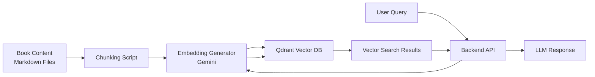

# Feature Specification: Qdrant Vector Database Integration

**Feature Branch**: `1-qdrant-integration`
**Created**: 2025-12-08
**Status**: Draft
**Input**: User description: "lets move to the second phase: # Qdrant Vector Database Integration Specs

> **Purpose:** Step-by-step prompts for integrating Qdrant vector database with book content
> **Context:** Following the structure of the current project (frontend, backend, auth-server)

---

## 🔧 Backend Package Manager: UV

The backend is built using uv, a fast Python package manager and resolver. All backend dependencies must be installed using the `uv` command.

### Required Package Installations

Navigate to the `backend/` directory and install the following packages:

```bash
cd backend

# Core Framework
uv add fastapi
uv add uvicorn

# AI & Embeddings
uv add openai-agents
uv add openai
uv add google-generativeai

# Vector Database
uv add qdrant-client

# Database & Authentication
uv add psycopg2
uv add pyjwt
uv add passlib
uv add bcrypt

# Utilities
uv add python-dotenv
```

### Complete Dependencies List

| Package | Version | Purpose |
|---------|---------|---------|
| `fastapi` | ≥0.122.0 | Web framework for building APIs |
| `uvicorn` | ≥0.38.0 | ASGI server for FastAPI |
| `openai-agents` | ≥0.6.1 | Agent framework with guardrails |
| `openai` | ≥1.59.6 | OpenAI API client |
| `google-generativeai` | ≥0.8.5 | Google Gemini API for embeddings & LLM |
| `qdrant-client` | ≥1.16.1 | Vector database client |
| `psycopg2` | ≥2.9.11 | PostgreSQL database adapter |
| `pyjwt` | ≥2.8.0 | JWT token handling |
| `passlib` | ≥1.7.4 | Password hashing utilities |
| `bcrypt` | ≥4.1.2 | Password hashing algorithm |
| `python-dotenv` | ≥1.0.0 | Environment variable management |

---

## 1. Overview

### Project Context

We have successfully created a book with content in our frontend. Now we need to:
1. Set up Qdrant vector database connection
2. Process and chunk the book content
3. Generate embeddings for the content
4. Ingest the content into Qdrant
5. Implement vector search for RAG queries

### Architecture



### Technology Stack

- **Vector Database:** Qdrant Cloud
- **Embeddings:** Google Gemini `text-embedding-004` (768-dim)
- **Backend:** Python 3.12+ with FastAPI
- **Client Library:** `qdrant-client` 1.16.1+

---

## 2. Project Structure

Our project has the following structure:

```
project/
├── frontend/                    # Docusaurus frontend
│   └── docs/                    # Book content (Markdown files)
│
├── backend/                     # Python FastAPI backend
│   ├── backend/                 # Core logic modules
│   │   ├── database.py          # DB & Qdrant clients, embeddings
│   │   └── ingest.py            # Document ingestion script
│   │
│   ├── src/backend/             # Main application
│   │   └── main.py              # FastAPI app with API endpoints
│   │
│   ├── .env                     # Environment variables
│   └── pyproject.toml           # Python dependencies (uv format)
│
└── auth-server/                 # Node.js authentication server
```

---

## 3. Prompts for Claude Code

Use these prompts in your Claude Code environment to set up the Qdrant integration:

### Prompt 1: Setup Database Client

```
Create a database.py file in backend/backend/ that:
1. Initializes Qdrant client using environment variables QDRANT_URL and QDRANT_API_KEY
2. Configures Google Gemini for embeddings using GEMINI_API_KEY
3. Implements get_embedding(text, task_type) function that returns 768-dim vectors using model text-embedding-004
4. Implements initialize_collection(collection_name) that creates a Qdrant collection with cosine distance
5. Add proper error handling and type hints

Use these imports:
- qdrant_client
- google.generativeai
- dotenv
```

---

### Prompt 2: Create Ingestion Script

```
Create an ingestion script backend/backend/ingest.py that:
1. Accepts --docs_path argument for the book content directory
2. Walks through all .md files recursively
3. Chunks each file into 1000-character segments with 200-char overlap
4. Generates embeddings for each chunk using the get_embedding function from database.py
5. Uploads all chunks to Qdrant collection "book_content" with metadata:
   - filename (relative path)
   - text (chunk content)
   - chunk_number (position)
   - total_chunks (total in document)
6. Shows progress with print statements
7. Handles errors gracefully

Make it runnable with: uv run backend/ingest.py --docs_path ../frontend/docs
```

---

### Prompt 3: Implement RAG Endpoint

> ⚠️ **Important:** The RAG AI must be built using the **OpenAI Agents SDK**.
> Before writing this code, use the skill: `openai-agents-sdk`

```
Use your openai-agents-sdk skill to implement the RAG system.

In backend/src/backend/main.py, add a RAG chat endpoint using OpenAI Agents SDK that:
1. Creates an Agent with Gemini model via OpenAI-compatible API
2. Accepts POST /api/chat with body: {user_query, selected_text?, chat_history?}
3. Generates query embedding using Gemini text-embedding-004
4. Searches Qdrant for top 5 relevant chunks (score_threshold=0.7)
5. Builds context from search results
6. Uses Agent with augmented system prompt containing the context
7. Implements guardrails for content safety and topic relevance
8. Returns {output, context_chunks, sources}

Also add a GET /api/search endpoint for direct vector search.
Include proper error handling and CORS configuration.
```

---

### Prompt 4: Create Test Suite

```
Create backend/backend/test_qdrant.py with test functions for:
1. test_connection() - verify Qdrant connectivity
2. test_embedding() - test embedding generation
3. test_upsert() - test uploading test point
4. test_search() - test vector search

Each test should print clear success/failure messages.
Make it runnable with: uv run backend/test_qdrant.py
```

---

### Prompt 5: Environment Configuration

```
Update backend/.env with:
1. QDRANT_URL (Qdrant Cloud cluster URL)
2. QDRANT_API_KEY (API key from Qdrant Cloud)
3. GEMINI_API_KEY (Google AI API key)
4. QDRANT_COLLECTION_NAME=book_content
5. SEARCH_LIMIT=5
6. SCORE_THRESHOLD=0.7
7. CHUNK_SIZE=1000
8. CHUNK_OVERLAP=200
```

---

### Prompt 6: Frontend Integration

```
In frontend/src/components/ChatBot/index.tsx:
1. Update the chat API call to include selected_text parameter
2. Display source citations from the response
3. Show number of context chunks used
4. Add loading state during RAG processing
5. Handle errors gracefully

The API endpoint is: http://localhost:8000/api/chat
```

---

### Prompt 7: Run Complete Workflow

```
Help me run the complete Qdrant integration workflow:
1. Verify all environment variables are set in backend/.env
2. Test Qdrant connection
3. Run ingestion script on my book content directory: uv run  backend/ingest.py --docs_path ../frontend/docs
4. Verify collection was created successfully
5. Test RAG endpoint with sample query
6. Start backend server: uv run uvicorn src.backend.main:app --reload
7. Test from frontend

Guide me through each step with verification commands.
```

---

## 4. Environment Variables

Required environment variables for `backend/.env`:

```env
# Qdrant Cloud Configuration
QDRANT_URL=https://your-cluster.qdrant.cloud:6333
QDRANT_API_KEY=your_qdrant_api_key

# Google Gemini API
GEMINI_API_KEY=your_gemini_api_key

# Collection Settings
QDRANT_COLLECTION_NAME=book_content

# RAG Settings
SEARCH_LIMIT=5
SCORE_THRESHOLD=0.7
CHUNK_SIZE=1000
CHUNK_OVERLAP=200
```

---

## 5. Troubleshooting

### Common Issues

| Issue | Error | Solution |
|-------|-------|----------|
| Connection Refused | `Cannot connect to Qdrant` | Verify QDRANT_URL format and API key |
| Dimension Mismatch | `Vector dimension mismatch` | Ensure collection uses 768 dimensions for Gemini |
| Slow Ingestion | Takes too long | Use batch uploads, reduce chunk size |
| Poor Search Results | Irrelevant context | Lower score_threshold, increase search limit |

---

## 6. Next Steps

After completing Qdrant integration:

1. ✅ Test End-to-End RAG Flow
2. ✅ Optimize Search Parameters
3. ✅ Add Advanced Features (metadata filtering, hybrid search)
4. ✅ Implement Monitoring
5. ✅ Production Deployment

---

**End of Qdrant Integration Specs**

> 💡 **Tip:** Work through prompts sequentially. Each prompt builds on previous steps."

## User Scenarios & Testing *(mandatory)*

### User Story 1 - Query Book Content via RAG (Priority: P1)

As a user, I want to ask questions about the book content and receive accurate responses with relevant citations, so that I can quickly find information from the book content without manually searching through documents.

**Why this priority**: This is the core value proposition of the feature - enabling users to interact with book content through natural language queries.

**Independent Test**: Can be fully tested by submitting a query to the RAG endpoint and verifying that the response contains relevant information from the book content with proper citations.

**Acceptance Scenarios**:

1. **Given** book content is ingested into Qdrant, **When** user submits a relevant query, **Then** the system returns a response with context from the book content and source citations
2. **Given** user submits a query, **When** the system processes the query against the vector database, **Then** the response is generated within 10 seconds with relevant information

---

### User Story 2 - Search Book Content Directly (Priority: P2)

As a user, I want to search the book content directly to find specific passages or topics, so that I can locate relevant information quickly.

**Why this priority**: Provides a foundational search capability that users expect and supports the RAG functionality.

**Independent Test**: Can be tested by making direct vector search requests and verifying that relevant book content is returned with proper metadata.

**Acceptance Scenarios**:

1. **Given** book content is indexed in Qdrant, **When** user performs a search query, **Then** the system returns the most relevant content chunks with metadata

---

### User Story 3 - View Source Citations (Priority: P3)

As a user, I want to see source citations in the responses, so that I can verify the information and navigate to the original content.

**Why this priority**: Critical for trust and verification of the AI responses.

**Independent Test**: Can be tested by checking that responses include proper source citations linking back to the original book content.

**Acceptance Scenarios**:

1. **Given** a query response is generated, **When** user views the response, **Then** source citations are displayed showing which documents and sections were used

---

### Edge Cases

- What happens when the Qdrant database is temporarily unavailable?
- How does the system handle queries that don't match any content in the vector database?
- What happens when the book content contains special characters or formatting that affects chunking?
- How does the system handle very long or complex queries?

## Requirements *(mandatory)*

### Functional Requirements

- **FR-001**: System MUST connect to Qdrant vector database using provided credentials
- **FR-002**: System MUST generate embeddings for book content using Google Gemini text-embedding-004 model
- **FR-003**: System MUST chunk book content into 1000-character segments with 200-character overlap
- **FR-004**: System MUST store book content chunks in Qdrant collection with metadata (filename, text, chunk number, total chunks)
- **FR-005**: System MUST provide a RAG chat endpoint that accepts user queries and returns contextual responses
- **FR-006**: System MUST implement vector search functionality to find relevant content based on user queries
- **FR-007**: System MUST return source citations with responses indicating which content was used
- **FR-008**: System MUST handle environment variables for configuration (QDRANT_URL, QDRANT_API_KEY, GEMINI_API_KEY)
- **FR-009**: System MUST provide a direct search endpoint for vector similarity search
- **FR-010**: System MUST implement proper error handling for database connectivity issues

### Key Entities

- **Book Content Chunk**: A segment of book content that has been processed and embedded for vector storage, containing the text content, metadata (filename, chunk number, total chunks), and embedding vector
- **Qdrant Collection**: A vector database collection storing book content chunks with their embeddings and metadata
- **Query Response**: The output from the RAG system containing the AI-generated answer, source citations, and context chunks used to generate the response