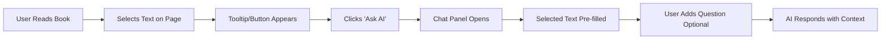

# Feature Specification: Text Selection to Chat

**Feature Branch**: `004-text-selection`
**Created**: December 10, 2025
**Status**: Draft
**Input**: User description: "Text Selection to Chat Feature - Implementation Prompt

> **Feature:** Allow users to select text from book content and send it directly to the AI chatbot
> **Context:** Docusaurus-based book reader with RAG chatbot integration
> **Created:** December 10, 2025

---

## Feature Overview

This feature enables users to:
1. **Select any text** from the book content (Markdown documentation pages)
2. **Click a context button** (e.g., \"Ask AI about this\")
3. **Automatically open the chatbot** with the selected text as context
4. **Receive AI responses** that use both the selected text and RAG-retrieved context from the vector database

---

## User Experience Flow



---

### Create Text Selection Detection Hook

```
Create a custom React hook in frontend/src/components/TextSelection/useTextSelection.tsx that:

1. Listens for text selection events using window.getSelection()
2. Detects when the user selects text (mouseup event)
3. Returns the selected text and position coordinates
4. Ignores selections within the chat widget itself
5. Clears selection state when text is deselected
6. Implements debouncing to avoid excessive re-renders

Requirements:
- TypeScript with proper type definitions
- Return object with: { selectedText: string, position: { x: number, y: number }, hasSelection: boolean }
- Clean up event listeners on unmount
- Handle edge cases (empty selections, multi-element selections)
```

---

###  Build Selection Popup Component

```
Create a SelectionPopup component in frontend/src/components/TextSelection/SelectionPopup.tsx that:

1. Appears near the selected text (using absolute positioning)
2. Shows a button with text \"Ask AI about this\" and a sparkle/AI icon
3. Fades in with smooth animation (0.2s ease-in)
4. Positions itself dynamically based on selection coordinates
5. Handles clicks to trigger the chat widget
6. Closes when user clicks elsewhere or deselects text
7. Uses glassmorphism design matching your existing chat widget style

Styling Requirements:
- Backdrop blur effect (backdrop-filter: blur(10px))
- Semi-transparent background with border
- Smooth transitions and hover effects
- Responsive positioning (avoid going off-screen)
- Z-index high enough to appear above content but below modals

Props:
- selectedText: string
- position: { x: number, y: number }
- onAskAI: (text: string) => void
- onClose: () => void
```

---

### Integrate Selection Handler with Docusaurus

```
Swizzle (customize) the Docusaurus DocItem component to integrate text selection:

1. Create frontend/src/theme/DocItem/index.tsx as a wrapper
2. Import the useTextSelection hook and SelectionPopup component
3. Wrap the default DocItem content with selection detection
4. Show SelectionPopup when text is selected
5. Connect to ChatBot component to open with selected text
6. Use Docusaurus's swizzle command: npm run swizzle @docusaurus/theme-classic DocItem -- --wrap

Implementation:
- Keep the default DocItem behavior intact
- Add selection overlay that doesn't interfere with reading
- Ensure proper React context for ChatBot communication
- Handle mobile/tablet devices (optional: show on long-press)
```

---

### Update ChatBot Component for Selected Text

```
Modify frontend/src/components/ChatBot/index.tsx to:

1. Accept a new prop: initialSelectedText?: string
2. Add a state variable for selected text context
3. Create an openWithSelection(text: string) method that:
   - Opens the chat panel if closed
   - Pre-fills the input OR shows the selected text as a \"context card\"
   - Optionally auto-sends the message with prompt: \"Explain this: [selected text]\"
   - Focuses the input field for user to add their question

4. Implement a global method or context provider to allow other components to trigger chat with text
5. Display the selected text prominently in the UI (e.g., as a quoted block above the input)
6. Add a close button on the context card to remove selected text

UI Design:
- Show selected text in a card with light background
- Add label \"Selected from book:\" above the text
- Include a \"Clear\" button to remove the context
- Ensure it's visually distinct from chat messages
```

---

### Backend RAG Endpoint Enhancement

```
Update backend/src/backend/main.py to properly handle the selected_text parameter:

Current endpoint: POST /api/chat
Request body: { user_query: string, selected_text?: string, chat_history?: [] }

Enhancements needed:

1. When selected_text is provided:
   - Use it as additional context in the RAG pipeline
   - Generate embedding for BOTH user_query AND selected_text
   - Boost relevance of vector search results that match selected_text topic
   - Include selected_text in the system prompt as \"User is asking about this specific passage\"

2. Modify the OpenAI Agents SDK agent creation to:
   - Accept dynamic system prompts
   - Prioritize selected_text context over generic RAG results
   - Return metadata indicating if selected_text was used

3. Response format:
   {
     \"output\": \"AI response text\",
     \"context_chunks\": [...],
     \"sources\": [...],
     \"used_selected_text\": true/false
   }

4. Add guardrails to ensure responses stay relevant to selected_text when provided
```

---

### Styling and User Experience Polish

```
Apply premium design to the text selection feature:

1. SelectionPopup.tsx styling:
   - Use vibrant gradient for the button background
   - Add subtle shadow and glow effect
   - Implement micro-animations (scale up on hover, pulse effect)
   - Make it feel modern and premium (avoid generic Material UI look)

2. ChatBot selected text context card:
   - Glassmorphism effect matching the chat widget
   - Smooth fade-in animation when displayed
   - Typography: use a serif font for the selected quote to differentiate from chat messages
   - Add a subtle left border or quotation mark icon

3. Interaction feedback:
   - Button ripple effect on click
   - Loading state while AI processes the query
   - Success feedback (e.g., checkmark) when message is sent

4. Responsive design:
   - Mobile: Show selection popup as a bottom sheet instead of tooltip
   - Tablet: Adjust positioning for landscape/portrait
   - Desktop: Tooltip near cursor position

Use your existing ChatBot.module.css patterns for consistency.
```

---

### Testing and Debugging

```
Create a comprehensive test plan for the text selection feature:

Manual Testing Checklist:
1. ✅ Select text on a documentation page
2. ✅ Verify popup appears near selection
3. ✅ Click \"Ask AI\" button and confirm chat opens
4. ✅ Check that selected text appears in chat context
5. ✅ Send a question and verify AI response uses the selected text
6. ✅ Test with different selection lengths (short, medium, long)
7. ✅ Test selecting across multiple paragraphs
8. ✅ Test deselection behavior (popup should disappear)
9. ✅ Test clicking outside popup (should close gracefully)
10. ✅ Test with chat already open (should add context to existing conversation)

Edge Cases to Handle:
- Selecting text inside code blocks
- Selecting text that includes images or links
- Selecting text from tables
- Mobile long-press selection
- Selection while chat widget is minimized
- Rapid multiple selections
- Empty or whitespace-only selections

Debugging Commands:
- Start backend: cd backend && uv run uvicorn src.backend.main:app --reload
- Start frontend: cd frontend && npm start
- Check browser console for errors
- Verify selected_text is sent in network request payload
```

---

## Technical Implementation Details

### Text Selection Logic (Browser API)

```javascript
// Pseudo-code for selection detection
window.addEventListener('mouseup', () => {
  const selection = window.getSelection();
  const text = selection?.toString().trim();

  if (text && text.length > 0) {
    const range = selection.getRangeAt(0);
    const rect = range.getBoundingClientRect();

    // Set state: { selectedText: text, position: { x: rect.x, y: rect.y } }
  }
});
```

### RAG Context Augmentation

When `selected_text` is provided, the backend should:

1. **Query Construction:**
   ```python
   if selected_text:
       augmented_query = f\"{user_query}\\n\\nContext: {selected_text}\"
   else:
       augmented_query = user_query
   ```

2. **System Prompt Enhancement:**
   ```python
   system_prompt = f\"\"\"You are an AI assistant helping users understand book content.

   The user has selected this specific text from the book:
   \\\"\\\"\\\"{selected_text}\\\"\\\"\\\"

   Use this as the primary context for your response. Also consider the following
   relevant sections from the book: {rag_context}

   Answer the user's question clearly and specifically reference the selected text.
   \"\"\"
   ```

3. **Embedding Strategy:**
   - Generate separate embeddings for selected_text and user_query
   - Perform hybrid search combining both
   - Boost results semantically similar to selected_text


---

## Environment Variables

No new environment variables needed. The feature uses existing:
- `GEMINI_API_KEY` (for embeddings and LLM)
- `QDRANT_URL` and `QDRANT_API_KEY` (for RAG search)

---

## Expected Behavior Summary

1. **User selects text** → Popup appears instantly
2. **User clicks \"Ask AI\"** → Chat opens with selected text visible as context
3. **User can add their question** → Or the system auto-generates one like \"Explain this passage\"
4. **AI processes request** → Uses selected text + RAG context from Qdrant
5. **Response is contextual** → Directly addresses the selected passage with supporting information

---"

## User Scenarios & Testing *(mandatory)*

<!--
  IMPORTANT: User stories should be PRIORITIZED as user journeys ordered by importance.
  Each user story/journey must be INDEPENDENTLY TESTABLE - meaning if you implement just ONE of them,
  you should still have a viable MVP (Minimum Viable Product) that delivers value.

  Assign priorities (P1, P2, P3, etc.) to each story, where P1 is the most critical.
  Think of each story as a standalone slice of functionality that can be:
  - Developed independently
  - Tested independently
  - Deployed independently
  - Demonstrated to users independently
-->

### User Story 1 - Select and Ask AI (Priority: P1)

As a user reading book content, I want to select text and instantly ask the AI about it so that I can get immediate clarification or explanation without having to copy/paste or remember the exact text.

**Why this priority**: This is the core value proposition of the feature - allowing users to get contextual help while reading without interrupting their flow.

**Independent Test**: Can be fully tested by selecting text on any documentation page and clicking the "Ask AI" button, which should open the chat with the selected text as context and provide a relevant response.

**Acceptance Scenarios**:

1. **Given** user is reading book content and has selected text, **When** user clicks the "Ask AI about this" button, **Then** the chat panel opens with the selected text pre-filled or displayed as context
2. **Given** user has selected text and clicked "Ask AI", **When** user submits a question about the selected text, **Then** the AI response directly addresses the selected text with additional context from the knowledge base

---

### User Story 2 - Visual Feedback for Selection (Priority: P2)

As a user, I want to see clear visual feedback when I select text so that I know the system recognizes my selection and offers the AI assistance option.

**Why this priority**: This provides the necessary UI/UX feedback that enables the primary user journey to work smoothly.

**Independent Test**: Can be tested by selecting text on a page and verifying that the "Ask AI about this" button appears near the selection with appropriate styling and positioning.

**Acceptance Scenarios**:

1. **Given** user begins selecting text on a page, **When** user releases the mouse button after making a selection, **Then** a contextual button appears near the selected text
2. **Given** button is visible after text selection, **When** user clicks elsewhere on the page, **Then** the button disappears and selection is cleared

---

### User Story 3 - Context Integration (Priority: P3)

As a user, I want the selected text to be properly integrated into the AI's context so that the response is specific to the selected content rather than generic.

**Why this priority**: This ensures the AI provides value by directly addressing the selected text with additional relevant information from the knowledge base.

**Independent Test**: Can be tested by selecting specific text, asking a question about it, and verifying that the AI response references the selected text directly and provides relevant additional information.

**Acceptance Scenarios**:

1. **Given** user has selected specific text and opened chat, **When** user asks a question about the selected text, **Then** the AI response specifically addresses the content of the selected text
2. **Given** user has selected text from a specific topic, **When** user submits their query, **Then** the response includes both the selected text context and additional relevant information from the vector database

---

### Edge Cases

- What happens when user selects text that is very long (over 1000 characters)?
- How does the system handle selections that span multiple HTML elements or paragraphs?
- What occurs when user selects text within code blocks or tables?
- How does the system behave when the chat widget is already open?
- What happens when user selects text but then scrolls away before clicking the button?
- How does the system handle empty selections or whitespace-only selections?
- What occurs when user makes a selection within the chat widget itself?

## Requirements *(mandatory)*

### Functional Requirements

- **FR-001**: System MUST detect text selection events using browser APIs and return the selected text content
- **FR-002**: System MUST display a contextual button near the selected text when text is selected
- **FR-003**: Users MUST be able to click the contextual button to open the chat with selected text as context
- **FR-004**: System MUST pass the selected text as additional context to the AI when processing queries
- **FR-005**: System MUST position the contextual button appropriately to avoid going off-screen
- **FR-006**: System MUST hide the contextual button when user deselects text or clicks elsewhere
- **FR-007**: System MUST handle selections across multiple HTML elements as a single unit
- **FR-008**: System MUST preserve formatting/structure of selected text when passing to AI
- **FR-009**: System MUST work on different screen sizes and device types (responsive)
- **FR-010**: System MUST not interfere with normal reading experience when no selection is made

### Key Entities *(include if feature involves data)*

- **SelectedText**: The text content that the user has highlighted/selected on the page, including position coordinates
- **ContextualButton**: The UI element that appears near the selection offering the "Ask AI" functionality
- **ChatContext**: The data structure that includes both the selected text and user's additional query

## Success Criteria *(mandatory)*

### Measurable Outcomes

- **SC-001**: Users can select text and initiate an AI conversation in under 3 seconds from selection
- **SC-002**: 90% of user-selected text is accurately captured and passed to the AI system without corruption
- **SC-003**: AI responses utilizing selected text context are rated as "relevant and helpful" by 80% of users
- **SC-004**: The contextual button appears consistently within 0.5 seconds of text selection across all supported browsers
- **SC-005**: Text selection functionality works on 95% of content pages without interfering with page functionality
